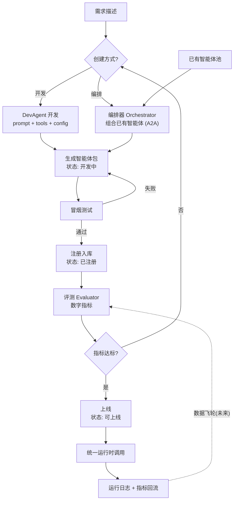

# Demo 设计

> 设计原则：**轻量、敏捷、先跑通最小闭环**。
> 继承两人核心设想：學彈舌的"智能体开发智能体（标准 + 方法论 + 批量任务）" + tuear-cb的"注册纳管 + 数字指标评测（治理层）"。

## 1. Demo 目标（先证明什么）

用一个最小闭环证明三个点：
1. **智能体可以由智能体开发/编排出来**：输入一句需求（开发）或组合已有智能体（编排）→ 输出一个可运行的智能体；
2. **智能体可注册纳管**：注册、配置、版本、上线状态流转（本地 CLI 完成）；
3. **评测靠数字/指标**（不靠 LLM 主观打分）：命中率、响应速度、token 消耗、违禁率。

## 2. Demo 场景（讲个故事）

用户输入一句话：

> "帮我做一个智能体：根据传入的开户信息文本，自动判断开户是否合规，输出 通过/驳回 + 理由"

一条 CLI 命令自动跑完整个闭环：
1. **设计**：开发智能体（DevAgent）根据需求生成设计（提示词、所需工具、输入输出协议）；
2. **实现**：生成 Python 智能体代码（一个可运行的 agent 包）；
3. **打包/注册**：把智能体注册入库（配置 + 代码 + 元信息，版本 v1）；
4. **评测**：用内置测试集跑评测 → 输出数字指标报告；
5. **上线**：评测达标 → 状态置为"可上线"，可通过统一运行时调用。

## 3. Demo 架构（最小闭环）

```
┌──────────────────────────────────────────────┐
│               CLI 流水线（入口）              │
│   create / register / evaluate / run         │
└───────────────────┬──────────────────────────┘
                    │
┌───────────────────▼──────────────────────────┐
│                核心组件                       │
│  DevAgent(开发)  Evaluator(评测)             │
│  Registry(纳管)  Runner(统一运行时)          │
└───────────────────┬──────────────────────────┘
                    │
┌───────────────────▼──────────────────────────┐
│        智能体 = 可执行包（核心抽象）          │
│   prompt.md + tools.py + agent.yaml          │
└───────────────────┬──────────────────────────┘
        ┌───────────┴───────────┐
        │  LLM (deepseek api)   │  本地存储 (SQLite)
        └───────────────────────┘
```

- **入口**：CLI 命令（create / register / evaluate / run），无 Web、零部署；
- **存储**：SQLite（智能体元信息、版本、评测结果、运行日志）；
- **Agent 运行时**：自研极简 ReAct 循环（不引 crewai/langgraph，保持可控、无黑盒）；
- **工具**：Python 函数注册为 tool（预留 MCP 包装点）。

## 4. 核心流程（Demo 怎么跑）

1. `create_agent(需求描述)` → DevAgent 生成"三件套"：
   - `prompt.md`：system prompt（设计产物）
   - `tools.py`：工具函数（函数即 tool）
   - `agent.yaml`：config（模型、约束、输入输出 schema）
2. DevAgent 自己写一个冒烟测试，验证智能体能跑通；
3. `register(agent)` 注册入库（版本 v1）；
4. `evaluate(agent_id)` 用内置测试集评测：
   - 逐条喂输入 → 收集输出 + token + 耗时；
   - 用代码/规则算指标（见 §7）；
5. 指标 ≥ 阈值 → 状态置为"可上线"；
6. 输出评测报告与运行日志（控制台/文件），完成一次生命周期闭环。

## 5. 智能体生命周期（mermaid）



> 创建来源（tuear-cb：开发 / 编排 / 动态创建）：**开发**（DevAgent 生成代码）或**编排**（组合已有智能体，A2A 协同），二者汇入同一条生命周期；状态流转：开发中 → 已注册 → 可上线；评测不达标回到创建方式重新迭代；**动态创建**、数据飞轮（回流）列为未来能力。

## 6. 智能体 = 可执行包（核心抽象）

一个智能体就是一个文件夹/包：

```
agents/<agent_id>/v1/
  prompt.md      # system prompt（设计产物）
  tools.py       # 工具函数（函数即 tool）
  agent.yaml     # 配置（模型、温度、约束、io schema）
  main.py        # ReAct 运行时（平台统一提供，智能体无需关心）
```

- 用**统一运行时**跑智能体，智能体只负责"内容"（提示词 + 工具 + 配置）；
- 于是"开发智能体"本质 = **生成这三个文件** → 简单、可版本化、可评测；
- 也是"可开发、可编排、可编译、可部署、可纳管"的最小载体；
- **编排型智能体**：包内用编排配置（引用已有智能体 + 协同/路由规则）替代手写工具，走同一条注册、评测、上线流程。

## 7. 评测（数字/指标，不靠 LLM 主观打分）

内置通用指标（即聊天里说的"治理层指标"）：

| 指标 | 怎么算 |
|---|---|
| 命中率 | 正确输出数 / 测试集总数（比对标准答案或规则校验） |
| 平均响应时间 | Σ耗时 / N |
| 平均 token 消耗 | Σtoken / N |
| 违禁回复率 | 命中违禁词库数 / N |
| 工具调用成功率 | 工具无异常次数 / 总调用次数 |

- 指标计算全部是**代码/规则**，不靠 LLM 打分（避免幻觉、无全局视角的问题）；
- **测试集、指标、阈值都存在本地配置里、可修改** → 支撑"评估体系可配置"的设想；
- 预留：以后把指标封装成 MCP server/tool，供评测智能体使用。

## 8. 技术选型（轻量）

| 项 | 选择 | 理由 |
|---|---|---|
| 语言 | Python 3.11+ | 熟悉、生态好 |
| 入口 | CLI（create/register/evaluate/run） | 无 Web、零部署 |
| 存储 | SQLite | 零部署、本地即用 |
| LLM | DeepSeek API（OpenAI 兼容） | 便宜、够用 |
| Agent 框架 | 自研极简 ReAct（约 200 行） | 可控、无黑盒 |
| 工具协议 | 函数即 tool，预留 MCP | 先简单后扩展 |
| 沙箱 | Demo 用目录隔离 + 子进程；容器化后置 | 不阻塞 Demo |

## 9. Demo 范围

✅ **做**（最小闭环）：
- 输入需求 → 自动生成智能体（prompt + tools + config）；
- 注册 / 版本 / 评测 / 上线 状态流转；
- 数字指标评测报告（控制台/文件输出）；
- 智能体可被统一运行时调用。

❌ **先不做**：
- **Web 管理平台 / 可视化界面**（本次 Demo 刻意砍掉，只做 CLI 闭环）；
- 容器沙箱、细粒度权限体系；
- MCP server 封装（只预留接口）；
- 数据回流飞轮、A2A 多智能体协同；
- 知识库 / RAG；
- 审计、登录、用户体系；
- 评估体系由 agent 自动设计（经验证明效果差，先不做）。

## 10. 落地顺序（轻量敏捷）

1. 定义智能体包格式 + 统一 ReAct 运行时 → 先**手工写一个智能体**验证能跑；
2. 实现 DevAgent（开发智能体）→ 能自动生成上面的包；
3. Registry + Evaluator → 跑出数字评测报告；
4. 用 CLI 命令把流水线串成完整闭环；
5. 找一个小场景（自动分析提单 / 开户合规）做端到端验证。

> 这样设计的好处：**先有一个能跑的最小闭环 demo**，把"智能体开发智能体 + 注册纳管 + 数字评测"三个核心设想一次串起来，后面再逐步加细节。

