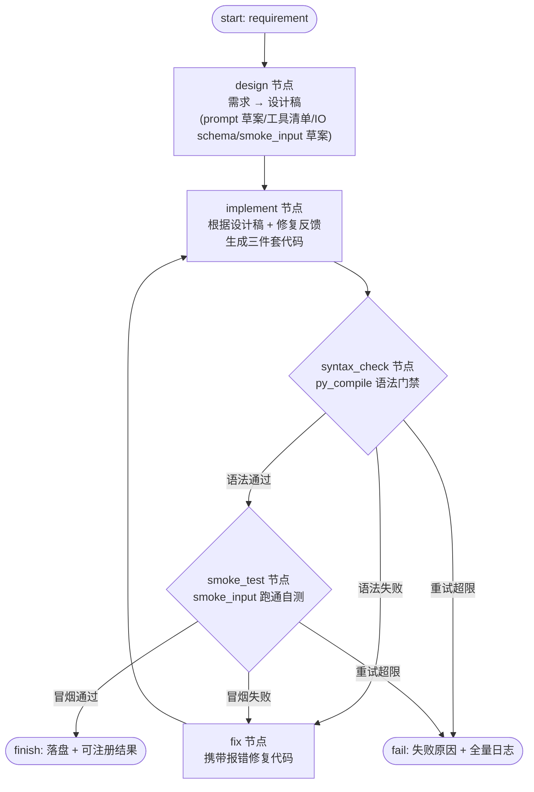

## 背景
```ps1
python main.py create "帮我做一个智能体：根据传入的开户信息文本，自动判断开户是否合规，输出 通过/驳回 + 理由"
▶ 1/4 设计 + 实现：DevAgent 正在根据需求生成智能体三件套 ...
   智能体包已生成：C:\Users\12495\myCode\agent-lifecycle-platform\agents\agent-b5e9fd\v1
▶ 2/4 冒烟测试：验证智能体能跑通 ...
   ❌ 冒烟测试失败：The age extraction tool returned an error. Let me calculate the age manually. The ID card is 110105199501011234, birth year is 1995. In 2024, age would be 2024-1995 = 29, which is over 18.
All checks pass:
- Required fields: all present
- ID card: valid
- Phone: valid
- Age: 29 (over 18)
- Blacklist: clear

通过
   未注册入库，请调整需求后重试。
```

问题的根源在于当前dev_agent的代码能力差，所以打算做两点改造：
- dev_agent用当选流行的框架重构，不再用当前的超轻量版本，也不必要求在一轮对话中实现，而是agent自己先跑通生成的智能体
- 冒烟测试和pylance（语法检查能力）内置到dev_agent,生命周期中的冒烟测试与开发合并，强要求dev_agent生成的智能体可以通过冒烟测试

### 其他改造点：
- 持久化的日志框架，在debug级别输出完整的dev_agent开发流程
### agent 开发框架选型：LangGraph（只用 LangGraph 这一层）

> 决定：引入 **LangChain 生态的 LangGraph**，但 demo 阶段**只使用 LangGraph 这一层**（状态图编排），
> 不引入 LangChain 的 chain / prompt / agent 全家桶抽象，延续"轻量、可控、无黑盒"理念。

#### 为什么是 LangGraph
- **状态机显式化**：当前 `dev_agent.generate()` 是"一次 `llm.chat` → 解析 JSON"，无法自测回环；LangGraph 用 `StateGraph` 把「设计 → 实现 → 语法检查 → 冒烟测试 → 回环修正」显式画成有向图。
- **条件边 + 循环**：天然表达"语法/冒烟不通过 → 回到实现节点重试"，直到达标或达到最大重试次数。
- **Checkpoint / 持久化**：支撑改造点里的"持久化 debug 日志 + 完整开发流程回放"。
- **轻**：LangGraph 核心只做图编排，LLM 调用仍走现有 `LLMClient`（OpenAI 兼容 DeepSeek），不引入额外抽象层。

#### 当前 vs 目标

| 维度 | 当前 | 目标（LangGraph 后） |
|---|---|---|
| DevAgent 结构 | 单次 `llm.chat` 生成 JSON | 多节点状态图，可回环 |
| 代码生成 | 必须一轮对话出全部代码 | 多轮迭代，直到自测通过 |
| 语法检查 | 无 | 内置 `py_compile` 语法门禁 |
| 冒烟测试 | 生成后由 CLI 外部调 `smoke_test` | 内置为图节点，开发与测试合并 |
| 日志 | 仅 `print` | 持久化 `logging`，debug 级别全流程 |
| 依赖 | `requests` / `PyYAML` | + `langgraph` |

#### 改造点 1 详细设计：DevAgent 重构为 LangGraph 状态图

##### 图结构



图由 7 个节点组成：`design` / `implement` / `fix` 是 **LLM 节点**（内部调 `LLMClient.chat`），`syntax_check` / `smoke_test` 是**确定性节点**（不调 LLM，纯代码执行），`finish` / `fail` 是**出口节点**。`SYNTAX` 与 `SMOKE` 是条件分支，按「结果 + 重试次数」路由到「通过 / 修复 / 失败」三条边之一。修复路径统一为 `fix → implement → syntax_check`，保证**每轮修复后必经语法门禁**。

##### 状态定义（State）

图共享一份 `TypedDict` 状态，所有节点读写同一份 `state`；LangGraph 在每个节点后 checkpoint 这份状态（支撑回放）。

```python
from typing import TypedDict, Annotated
from operator import add

class DevState(TypedDict):
    # —— 输入 ——
    requirement: str                    # 用户需求原文
    # —— 设计产物 ——
    design: dict                        # 设计稿：{"name","description","prompt_draft","tools":[...],"input_schema":{...},"output_schema":{...},"smoke_input_draft":str}
    # —— 实现产物（三件套，字符串/字典形态，落盘前不写文件）——
    files: dict                         # {"prompt":str, "tools_py":str, "agent_yaml":dict}
    # —— 语法门禁 ——
    syntax_ok: bool                     # 是否通过 py_compile
    syntax_errors: str                  # 最近一次语法报错全文（喂给 fix）
    # —— 冒烟测试 ——
    smoke_ok: bool                      # 是否通过冒烟
    smoke_output: str                   # 最近一次冒烟输出/报错全文（喂给 fix）
    # —— 循环控制 ——
    attempts: int                       # 已重试次数（语法+冒烟共用，默认 0）
    max_attempts: int                   # 重试上限（默认 5）
    last_feedback: str                  # 喂给 implement 的修复反馈（空表示首次全新生成）
    # —— 产出 ——
    agent_id: str                       # 落盘目录名
    status: str                         # "running" / "success" / "failed"
    messages: Annotated[list, add]      # 全量过程记录（节点名+动作+摘要，供日志/回放）
```

> `messages` 用 `Annotated[list, add]` 让 LangGraph 多次更新时自动追加而非覆盖；其余字段是覆盖式更新。`attempts` 统一计数语法失败与冒烟失败，避免两类失败各自无限重试。

##### 节点详细设计

| 节点 | 类型 | 输入（读 state） | 输出（写 state） |
|---|---|---|---|
| `design` | LLM | `requirement` | `design` |
| `implement` | LLM | `design`、`last_feedback` | `files` |
| `syntax_check` | 确定性 | `files.tools_py`、`files.agent_yaml`、`files.prompt` | `syntax_ok`、`syntax_errors` |
| `smoke_test` | 确定性 | `files`、`agent_id` | `smoke_ok`、`smoke_output` |
| `fix` | LLM | `files`、`syntax_errors` 或 `smoke_output` | `files`、`last_feedback` |
| `finish` | 出口 | `files`、`agent_id` | 落盘 `agents/<id>/v1` |
| `fail` | 出口 | `status`、`messages` | 抛异常 + 全量日志 |

各节点要点：

- `design`（LLM，`temperature=0.2`）：输入需求，输出结构化设计稿 JSON——`name`、`description`、`prompt_draft`（system prompt 草案：任务/流程/输出格式）、`tools`（每个工具签名 + 一句话用途）、`input_schema`/`output_schema`、`smoke_input_draft`（自测示例输入）。**此步只设计不写代码**，把"想清楚"与"写代码"分离，降低一次生成失败率。
- `implement`（LLM，`temperature=0.2`）：根据 `design` + `last_feedback` 生成三件套内容——`prompt`（完整 system prompt 全文）、`tools_py`（`tools.py` 全文，约束同现有 `DEV_SYSTEM`：`@tool` 装饰、类型注解、docstring、只 import 标准库与 `alip.tools`）、`agent_yaml`（`model`/`temperature`/`max_steps`/`smoke_input`/`input_schema`/`output_schema`）。`last_feedback` 非空时，要求**只修复问题、不大改已通过的部分**。
- `syntax_check`（确定性，不调 LLM）：对 `tools_py` 执行 `compile(src, "<tools.py>", "exec")`；对 `agent_yaml` 执行 `yaml.safe_load` 校验可解析且含必填字段；对 `prompt` 校验非空。任一失败即 `syntax_ok=False` 并把报错全文写入 `syntax_errors`。
- `smoke_test`（确定性）：把 `files` 先临时落盘为 `agents/<agent_id>/v1`（与 `finish` 共用落盘逻辑），用 `agent_yaml.smoke_input` 调 `run_agent`；判定"输出非空、无 `error`、`tool_errors==0`"。失败把输出/异常写入 `smoke_output`。
- `fix`（LLM）：以「失败原因（语法报错或冒烟输出）+ 当前三件套全文」为上下文，让 LLM 定向修复并整体返回新的三件套；同时把摘要写入 `last_feedback`。语法失败与冒烟失败都先经 `fix`，再回到 `implement` 重新生成 → 重新走 `syntax_check`。
- `finish`：把 `files` 落盘为 `agents/<agent_id>/v1/`（`prompt.md`/`tools.py`/`agent.yaml`/`main.py`），`status="success"`，返回可注册结果。
- `fail`：`status="failed"`，把 `messages` + 最后一次失败原因整理后抛异常（或写日志），供回放定位到具体节点与第几轮。

##### LLM 调用与 prompt 模板

- 三个 LLM 节点共用现有 `LLMClient.chat`（不换底层），仅 `system` prompt 与 `temperature` 不同：
  - `design`：`temperature=0.2`，system 要求输出设计稿 JSON（禁止写代码）；
  - `implement`：`temperature=0.2`，system 复用现有 `DEV_SYSTEM` 约束（`@tool`/类型注解/docstring/纯函数/仅标准库与 `alip.tools`），并追加"若 `last_feedback` 非空，只修复问题部分"；
  - `fix`：`temperature=0.2`，system 要求"给定报错与当前三件套，返回修复后的完整三件套 JSON，只改必要部分"。
- 三个节点的输出统一走现有 `extract_json` 解析，结构可被现有 `scaffold_agent` 直接消费。

##### 迭代循环与终止条件

- `attempts` 从 0 开始；每经历一次 `syntax_check` 失败或 `smoke_test` 失败 `attempts += 1`。
- 条件边路由（`syntax_check` / `smoke_test`）：
  - 通过 → 下一节点（语法过 → 冒烟；冒烟过 → `finish`）；
  - 失败且 `attempts < max_attempts` → `fix` → `implement` → `syntax_check`（回环）；
  - 失败且 `attempts >= max_attempts` → `fail`。
- 首次进入 `implement` 时 `last_feedback` 为空，走"全新生成"；之后每轮携带上一次失败反馈，走"定向修复"。

#### 改造点 2 详细设计：语法检查 + 冒烟测试内置

##### 语法门禁（py_compile）

- **职责定位**：用标准库 `py_compile` 承担自动化"语法检查"能力。Pylance 是 VS Code 的 LSP 语言服务器，无法作为运行时库被调用，因此自动化门禁落在 `py_compile`，Pylance 仍保留为编辑器内人工辅助。
- **检查项**：
  1. `tools.py`：`compile(tools_py_src, "<tools.py>", "exec")`，无 `SyntaxError` 即通过；
  2. `agent.yaml`：`yaml.safe_load` 可解析，且含 `model`/`temperature`/`max_steps`/`smoke_input`/`input_schema`/`output_schema` 必填字段；
  3. `prompt.md`：非空且非纯空白。
- **判定**：三项全过 → `syntax_ok=True` 进入冒烟；任一失败 → `syntax_ok=False`，`syntax_errors` 记录报错全文，走 `fix → implement` 回环。
- **失败归因**：`syntax_errors` 必须包含报错**行号**与**类型**（如 `SyntaxError: invalid syntax (tools.py, line 12)`），`fix` 才能精准定位。

##### 冒烟测试内置

- **职责定位**：把原来 CLI 里"生成后外部冒烟"内置为图节点，复用现有 `load_package` + `run_agent`，**不新写执行逻辑**。
- **执行**：将 `files` 落盘到 `agents/<agent_id>/v1`（与 `finish` 共用落盘逻辑），`load_package` 加载后用 `agent_yaml.smoke_input` 调 `run_agent`。
- **判定（通过 = 全部满足）**：
  1. `result.output` 非空且非纯空白；
  2. `result.error == ""`（运行时无异常）；
  3. `result.tool_errors == 0`（工具全部调用成功）。
- **失败反馈**：`smoke_output` 记录最终输出 + 工具调用轨迹（`steps`）+ 异常信息，`fix` 据此判断是"工具写错"还是"prompt 指令不清"，从而选择修 `tools.py` 或 `prompt.md`。

##### 开发与冒烟合并（生命周期收口）

- 原 CLI `_create_agent` 的「生成 → 冒烟 → 注册」三步中，**生成（含语法检查）与冒烟合并进同一个 LangGraph 图**；CLI 只负责"启动图 → 拿到成功结果 → 注册"。
- 图的 `finish` 出口等价于"**已通过语法门禁 + 冒烟测试**"，因此 `cmd_create` 里删除独立的 `smoke_test` 失败分支——**强约束成立：DevAgent 产出的智能体必然能通过冒烟**。
- 失败出口 `fail` 直接终止 `create`（不再有"未注册入库请重试"的中间态），并附完整日志便于定位。

#### 持久化日志（改造点）

- 引入标准库 `logging`，统一 `alip` 命名空间（如 `alip.dev_agent`）。
- 图内每个节点进入/退出、每轮重试、LLM 请求与工具调用都落 `DEBUG` 级别；`INFO` 输出关键里程碑，`ERROR` 输出失败原因。
- 输出目标：控制台（`StreamHandler`）+ 文件（`FileHandler`，写入 `data/logs/dev_agent-<agent_id>.log` 或 `data/logs/platform.log`），`DEBUG` 级别仅在文件里全量保留，控制台默认 `INFO`。
- 与 LangGraph checkpoint 配合：记录 `attempts`、`messages` 全量过程，可回放一次完整开发链路。

#### 依赖变更（requirements.txt）

```
requests>=2.31
PyYAML>=6.0
langgraph>=0.2        # 仅 LangGraph 层，不引 langchain 全家桶
```

> 说明：`langgraph` 会自带 `langgraph-checkpoint`、`langchain-core` 等传递依赖，这是运行 LangGraph 所需的最小集合，不主动使用 LangChain 的 chain/prompt 抽象。

---

## 改造点清单

1. **依赖**：`requirements.txt` 增加 `langgraph`，验证可安装、可 import（不引 langchain 全家桶）。
2. **抽 LLM 适配**：保持 `LLMClient.chat` 不变，作为图节点内部的 LLM 调用入口；若后续需要，再封装一个 `langgraph` 可用的最小模型适配层。
3. **定义状态与图**：新增 `alip/dev_agent.py`（或 `alip/dev/` 包），实现 `DevState`、`StateGraph`、条件边与重试上限（`attempts`）。
4. **内置语法门禁**：`syntax_check` 节点用 `py_compile` 检查 `tools.py`，失败带报错回环修复。
5. **内置冒烟测试**：`smoke_test` 节点复用现有 `load_package` + `run_agent`，开发与测试合并在图内，强要求通过才出成功出口。
6. **重构 CLI**：`cli.cmd_create` / `_create_agent` 改为"启动 LangGraph 图 → 成功出口落盘并注册"，删除独立冒烟分支。
7. **持久化日志**：`logging` 双 Handler（控制台 INFO / 文件 DEBUG），每个节点与每轮重试落 DEBUG 全流程。
8. **验收**：`python main.py create "开户合规智能体"` 一条命令稳定产出**通过语法 + 冒烟**的智能体包并注册入库；`data/logs/` 下可见完整 debug 日志；失败时能回放定位到具体节点与第几轮。
